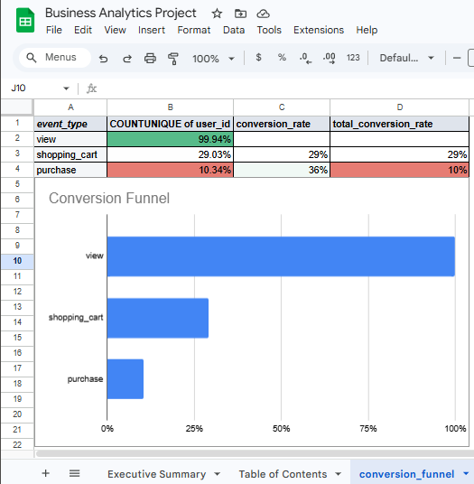

# 📊 E-commerce Conversion Funnel & Retention Analysis (Google Sheets)

## 🔍 Project Overview
This project analyzes user behavior on an e-commerce website to identify conversion drop-offs and retention patterns. The analysis focuses on how users move from product views to purchases and how engagement changes over time.

## 🔗 Project Artifacts
- [View Google Sheets Analysis](https://docs.google.com/spreadsheets/d/1KjBeZMZerpPYEbjJx_XBPkSxZ-XG4JFDrXceNrnnbDg/edit?usp=drive_link)

## 📈 Key Insights

### 🛒 Conversion Funnel
- Tracked unique users across product view → cart → purchase stages  
- Only **29%** of users added items to cart  
- Only **36%** of cart users completed a purchase  
- Overall conversion rate was approximately **10%**

### 🔁 Retention Analysis
- Grouped users into monthly cohorts based on first purchase  
- Month 1 retention ranged from **4%–12%**  
- Retention dropped sharply after Month 1, approaching zero by Months 3–4  
- Earlier cohorts showed slightly stronger retention trends  

## 🛠️ Tools Used
- Google Sheets / Excel (Pivot Tables, cohort analysis, funnel calculations)

## 💡 Key Takeaways
- Significant drop-off occurs before cart engagement  
- User retention declines rapidly after initial purchase  
- Results highlight opportunities to improve onboarding, cart experience, and post-purchase engagement  

## 👤 Author
Elizabeth Parr
